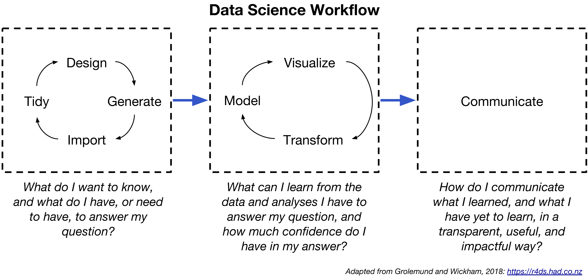

## {data-background=#FFFFFF}

```{r setup, include=FALSE}
knitr::opts_chunk$set(echo = TRUE, warning = FALSE, message = FALSE, fig.align = "center")
options(knitr.table.format = "html") 
library(tidyverse)
```

**Ghent University**
<br>
<br>
Using R, RStudio, and GitHub
<br>  
<br>
<small>
Brian S. Anderson, Ph.D.  
Associate Professor | Bloch School of Management  
Visiting Professor | Entrepreneurship and Innovation Group, Ghent University  
andersonbri@umkc.edu
</small>

```{r, echo = FALSE, out.width = "30%", fig.align = "left"}

```

## 

I made this presentation with R and R Studio. It's also posted on GitHub, [along with the code](https://github.com/drbanderson/Presentations).

##

You can do all sorts of things with R Studio, [like this](https://www.drbanderson.com).

##

[And this](https://dsom5509.github.io).

##

[And this](https://dsom5509.github.io/FilteringIllustration.html).

##

[And this](https://dsom5509.github.io/Session3TeamDeliverableSolution.pdf).

##

You can also create...

- MS Word documents
- MS PowerPoint presentations
- Books
- Handouts

##

You can also do a little statistics :)

##

It's all about the workflow...

##

```{r, echo = FALSE}

```

##

Why else should you use R and GitHub?

##

Replicability.

##

Reproducibility.

##

Transparency.

##

In my opinion, this is where the field is going.

##

Head to https://rstudio.cloud/ and lets do some live coding :)

##

Git, GitHub, and version control.

##

Think of GitHub as both a collaboration tool, and as a backup tool. 

##

If you are not familiar with writing code, GitHub is going to seem pretty foreign, and potentially not worth the trouble.

##

My argument is that it is worth the trouble, because it enables workflow...

```{r, echo = FALSE}

```

##

How many of you have a folder on your computer with contents that look like this...

- 12Feb2018Data_Original.dta
- 12Feb2018Data_Working.dta
- 15Feb2018Data_JaneModified_V1.dta
- 15Feb2018Data_JaneModified_V2.dta
- 15Feb2018Data_V3_USETHIS.dta
- 20Feb2018Data_V4_DONTUSE.dta
- ...

##

For researchers, particularly when using R (or related platforms), GitHub is a way for research teams to collaborate on analyses (and writing papers) while keeping things organized and integrated.

##

Head over to [github.com/drbanderson](https://github.com/drbanderson) 

##

Open Discussion

##

Download this presentation as a .Rmd at [github.com/drbanderson/Presentations](https://github.com/drbanderson/Presentations)  

<br>

View in your browser at [drbanderson.com/presentations/BenefitsOfR.html](https://www.drbanderson.com/presentations/BenefitsOfR.html)