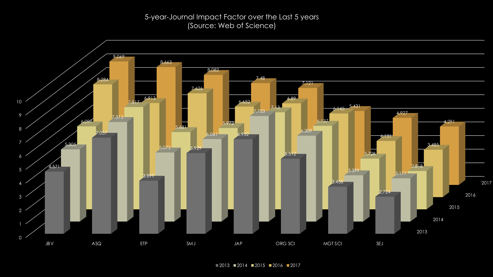
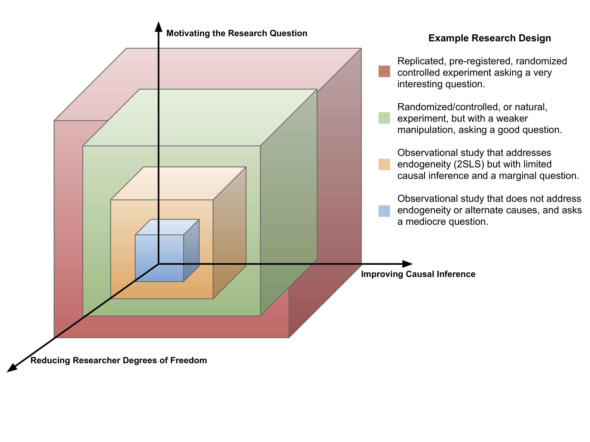

## {data-background=#FFFFFF}

```{r setup, include=FALSE}
knitr::opts_chunk$set(echo = TRUE, warning = FALSE, message = FALSE, fig.align = "center")
options(knitr.table.format = "html") 
library(tidyverse)
```

**Ghent University**
<br>
<br>
Publishing in *Journal of Business Venturing* and Trends in Entrepreneurship Research
<br>  
<br>
<small>
Brian S. Anderson, Ph.D.  
Associate Professor | Bloch School of Management  
Visiting Professor | Entrepreneurship and Innovation Group, Ghent University  
andersonbri@umkc.edu
</small>

```{r, echo = FALSE, out.width = "30%", fig.align = "left"}
knitr::include_graphics("Bloch_Wordmark_Rev_CMYK.png")
```

## 

With the growth of entrepreneurship doctoral programs, we are seeing a wave of new assistant professors with entrepreneurship as their primary discipline.

##

As a field, we are as multi-disciplinary, multi-functional, multi-contextual, and multi-level as ever before. 

So...

##

This makes it an exciting time to be an entrepreneurship scholar. 

But...

##

It's harder than ever to publish.

##

**Stats about JBV**

- Acceptance rate 4-6% for the prior five years
- 2017 Journal impact factor of 6.0
- 2017 5-year journal impact factor of 9.67
- Ranked 10th (out of 140 journals) by SSCI for Business Category
- Ranked 1st (out of 169 journals) by SSCI for Management of Technology and innovation

##

**JBV in 2018**

- 774 new manuscripts submitted in 2018
- 49.5% desk rejection rate (Average 1.1 week)
- 11.6 week avg. until first standard decision
- 58.3 week avg. until online (from initial submission)
- 75.6 week avg. until final publication (from initial submission)
- 9% acceptance rate in 2018 (includes special issues)

##

*"The entrepreneurial orientation-performance link is not a big enough conversation in the strategy literature to warrant a paper discussing causal inference. I noticed that much of your reference list cites entrepreneurship papers. I suspect your paper has a better fit with a specialist entrepreneurship journal as opposed to a general interest strategy journal such as SMJ."*

##

```{r, echo = FALSE}

```

##

**Myths about JBV**

- "It's just a specialty journal"
- JBV doesn't publish review articles
- There is a bias against qualitative research
- It's a clic

##

JBV (and entrepreneurship research) moving forward...

##

Leading [the entrepreneurship conversation](https://doi.org/10.1016/j.jbusvent.2019.02.004).

##

[Increasing rigor](https://www.drbanderson.com/papers/Anderson_etal_2019.pdf), but not at the expense of asking interesting and relevant questions.

##

```{r, echo = FALSE}

```

##

Reading my very---very---cloudy crystal ball...

##

The bar will get exponentially higher to publish theory-testing work

##

There will be a meaningful shift to mixed-methods research designs

##

Survey-only research will fade (but not go away)

##

*Exploratory* research will rise in prominence and sophistication

##

If I could wave my wand, what would I change?

- Ban SPSS
- Require code sharing (and ideally data)
- Require a replication
- The p-value would go away completely

##

The biggest change I would make?

The phrase "make a theoretical contribution" goes away. Forever. Period dot. 

##

Some practical tips for submitting to JBV and other top entrepreneurship journals...

##

"Making a theoretical contribution" (I hate even saying that phrase!) is, in my opinion, a function of the quality of writing and the quality of the argumentation.

##

Want to improve your chances for an R&R? Invest in being a better writer.

##

- King, S., 2002. On Writing. Simon and Schuster, New York, NY.
- Sword, H., 2017. Air & Light & Time & Space: How Successful Academics Write. Harvard University Press, Cambridge, MA.
- Sword, H., 2012. Stylish Academic Writing. Harvard University Press, Cambridge, MA.
- Zinsser, W., 2006. On Writing Well, 30th Anniversary Edition: The Classic Guide to Writing Nonfiction. Harper Collins, New York, NY.

##

It's better to tell a simple story well than a complicated story poorly.

##

Understand the reviewer disturbance term, particularly when it comes to research design and data science.

##

Selling reviewers is important, selling the editor is critical.

##

No, having a "big name" on the paper doesn't help. I promise. 

##

**Why I might desk reject a paper...**

- Poor writing and argumentation
- Failing to address endogeneity if a theory testing paper
- Not dealing with measurement error
- HARKing and p-hacking
- Failing to disclose data re-use

##

Yes, the bar is getting higher, but "Entrepreneurship research flourishes when the rigor of the empirics rises to the relevance of the question."

##

Open Discussion

##

You can download this presentation as a .Rmd at [github.com/drbanderson/Presentations](https://github.com/drbanderson/Presentations), or view in your browser at [drbanderson.com/presentations/PublishingInJBV.html](https://www.drbanderson.com/presentations/PublishingInJBV.html)
